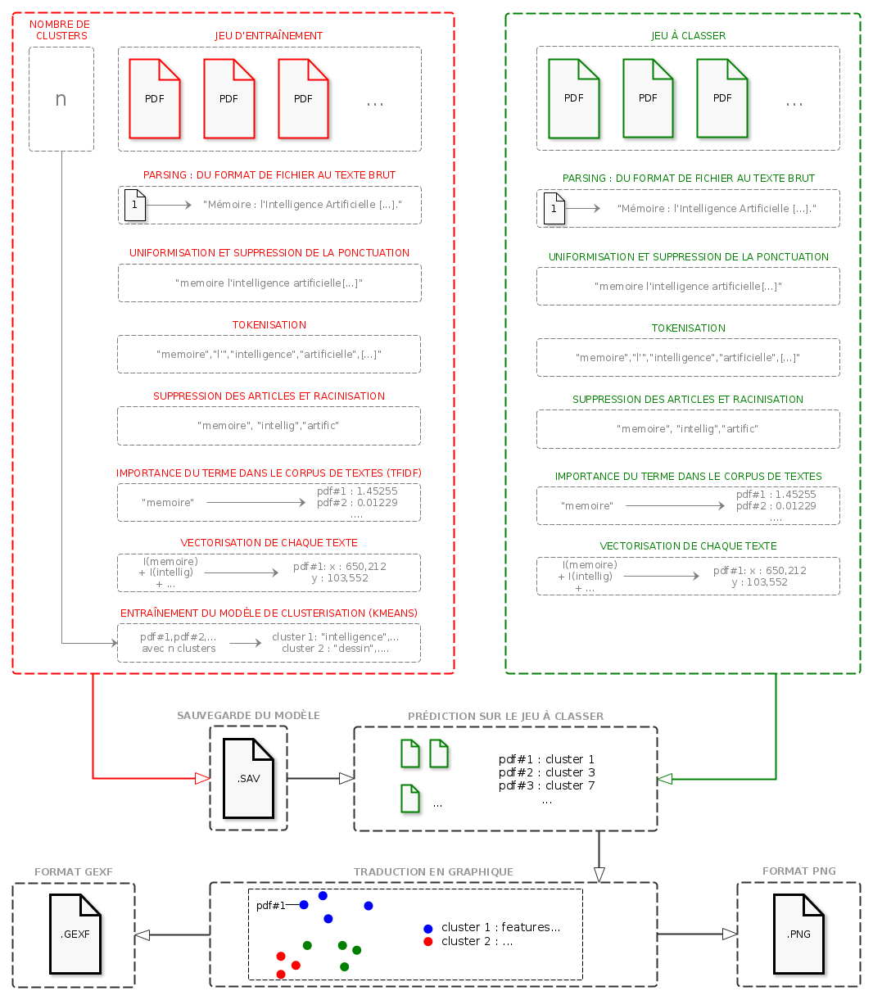
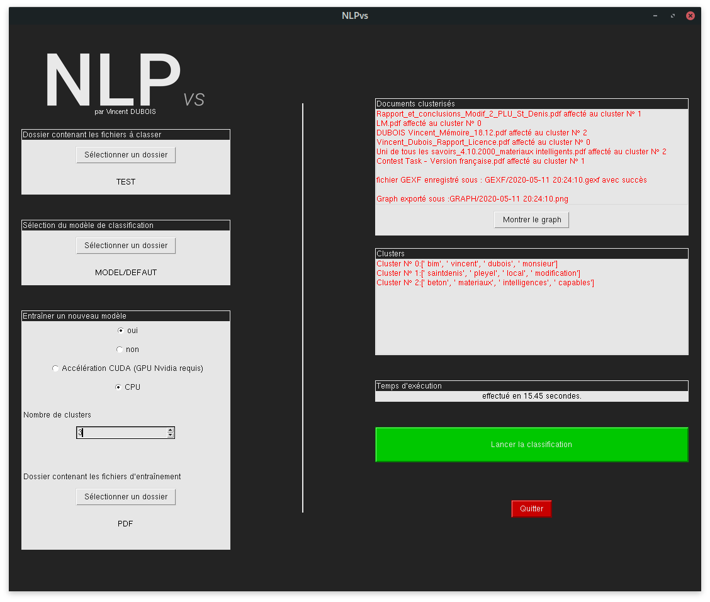
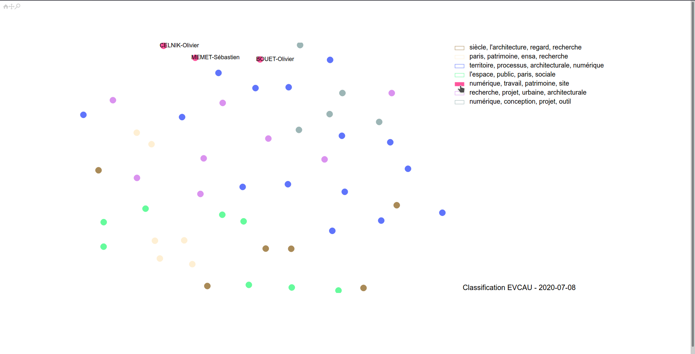

# NLPvs (Dernière màj 10/07/2020)

<h2>Description générale</h2>

NLPvs est un outil de classification de documents contenants du texte (actuellement prévu pour des fichiers aux formats PDF et HTML) en combinant une analyse de proximité sémantique grâce à l'établissement d'une matrice Tf-idf, ainsi que l'algorithme de clustering Kmeans, outil de Machine Learning non-supervisé.

# Current Status 

<h3>Fonctionnalités</h3>

<ul>
  <li>Permet la classification d'un corpus de documents PDF ou HTML, en spécifiant un nombre de clusters défini.</li>
  <li>Le résultat des différents clusters, leurs features ainsi que les documents qui leurs sont affectés se présenteront non seulement sous forme textuelle sur l'interface, mais surtout à travers une page html interactive, pour une meilleure lisibilité des résultats.</li>
  <li>Cette page HTML étant suvegardée en local, il est possible de la partager et/ou de l'intégrer à un site web facilement</li>
</ul>

<h3>Interface</h3>

<h3>Graph example</h3>

# Installation

<ul>
  <li>NLPvs a été développé en Python (3.7.6, but should work on latest available version) au sein d'un environnement Anaconda, recommandé pour l'installation des modules requis : <a href=https://www.anaconda.com/>Anaconda</a></li>
  <li>La liste des modules requis et leurs commandes d'installation respectives sont spécifiées dans le fichier <a href="requirements.md">requirements</a></li>
</ul>

# Prochaines fonctionnalités à développer

<ul>
  <li>Accélération CUDA</li>
  <li>Benchmark entre CPU et GPU sur la tâche de classification</li>
</ul>

# Ressources annexes

<ul>
  <li><a href=https://www.nltk.org/book/ch01.html>A quick look at basic NLTK features</a></li>
  <li><a href=https://www.nltk.org/book/ch06.html/>Text classification with NLTK</a></li>
  <li><a href=https://huggingface.co/transformers/usage.html>Huggingface's Tranformer possible usages</a></li>
  <li><a href=https://ngc.nvidia.com/catalog/containers/nvidia:pytorch>Pytorch distro from NVIDIA NGC</a></li>
  <li><a href=https://github.com/getalp/Flaubert>Dépôt Github de FlauBERT</a></li>
  <li><a href=https://camembert-model.fr/>CamemBERT, modèle BERT préentraîné sur le Français</a></li>
  <li><a href=https://github.com/adashofdata/nlp-in-python-tutorial/>NLP avec Python - Ipython Notebooks</a></li>
  <li><a href=https://www.youtube.com/watch?v=xvqsFTUsOmc>Conférence : NLP in Python</a></li>
  <li><a href=https://www.youtube.com/playlist?list=PLZHQObOWTQDNU6R1_67000Dx_ZCJB-3pi>Neural Network, Gradient Descent and Back Propagation explained - by 3Blue1Brown</a></li>
  <li><a href=https://www.youtube.com/watch?v=fNxaJsNG3-s>"Tokenization" for NLP explained - by Tensorflow</a></li>
  <li><a href=https://youtu.be/r9QjkdSJZ2g>From sentences to data for machine learning - by Tensorflow</a></li>
  <li><a href=https://youtu.be/Y_hzMnRXjhI>Sentiment analysis model : Embedding words - by Tensorflow</a></li>
  <li><a href=https://scikit-learn.org/stable/modules/clustering.html#clustering>Scikit-learn : Clustering for ML (K-means explained)</a></li>
  <li><a href=https://medium.com/@MSalnikov/text-clustering-with-k-means-and-tf-idf-f099bcf95183>TF-IDF Explained and applied</a></li>
  <li><a href=https://medium.com/rapids-ai/combining-speed-scale-to-accelerate-k-means-in-rapids-cuml-8d45e5ce39f5>Accelerate K-means with CUDA using RAPIDS</a></li>
  <li><a href=https://scikit-learn.org/stable/modules/model_persistence.html>Good advices to manage dumped models</a></li>
  <li><a href=http://brandonrose.org/clustering>Document Clustering with Python</a></li>
  
</ul>