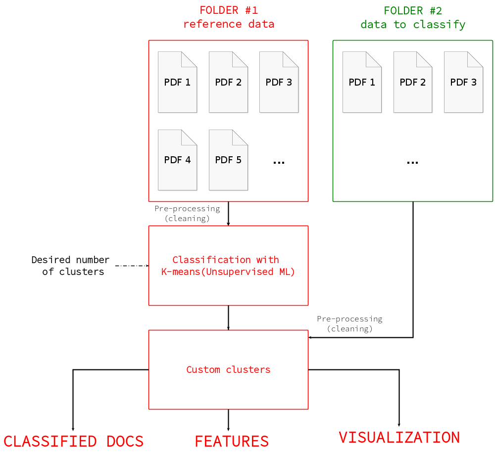

# NLPvs (17/04/2020 Update)

<h2>About NLPvs</h2>

NLPvs is a WIP student project aimed to parse a large ammount of text from PDF files. Although it has been imagined to crunch research-oriented documents written in French (such as thesis, etc...), its use could be easily extended to other fields.

# Current Status 

<h3>Features</h3>

<ul>
  <li>directory file-searching function (scans a given folder in the same directory as the source code to find all its files, their paths and will even search in subpaths)</li>
  <li>cleaning lvl 1 function (remove non-unicode caracters and \n from the raw extracted text)</li>
  <li>text to sentences division function (using NLTK)</li>
  <li>sentence cleaning function (all in low_case, remove punctuation)</li>
  <li>tokenization, stop-words removing and stemming function (divide each sentence into a list of words, in which we remove the useless words (meaning-wise) and truncate prefixes and suffixes to keep the root of the word)</li>
  <li>word vectorizing function (convert a group of words into a vector based on the most frequent words)</li>
  <li>K-means exploit function (using the K-means machine learning model to classify the refrence data into a given number of clusters) </li>
  <li>Model testing function (classify one or many other PDF docs located in a dedicated directory according to the previously defined clusters) </li>
  <li>Quick Benchmark technique (using the time library) </li>
</ul>

<h3>In progress</h3>

<ul>
  <li>Proper results printing (dataframe and graph)</li>
  <li>Hapaxes-finding function</li>
</ul>

# Requirements to run the latest source file

<h3>Required</h3>

<ul>
  <li>Python (3.7.6, but should work on latest available version)</li>
  <li><a href=https://www.nltk.org/>NLTK</a>, a Natural Processing Language library</li>
  <li><a href=https://pandas.pydata.org/>Pandas</a>, used to create dataframes(tables) from the extracted data</li>
  <li><a href=https://github.com/pdfminer/pdfminer.six#pdfminersix>PDFMiner.six</a>, a PDF parsing library</li>
  <li><a href=https://scikit-learn.org/stable/index.html>Scikit Learn</a>, Machine Learning Oriented API</li>
  <li>a folder in the same directory as the source code to dump all the PDF files to use as reference data (either call it <code>PDF</code> or change the name in the source code to whatever name you wish)</li>
  <li>another folder in the same directory as the source code to dump all the PDF files to classify (either call it <code>TEST</code> or change the name in the source code to whatever name you wish)</li>
  <li>Some reference PDF files (to build the clusters from)</li>
  <li>Some test PDF files (to test the classification)</li>
</ul>

<h3>Optional</h3>

<ul>
  <li><a href=https://www.anaconda.com/>Anaconda</a>, an easy to setup Python developement platform</li> 
</ul>

# Roadmap

<h3>Machine-learning part</h3>

<ul>
  <li>Accelerate K-means on GPU with the use of RAPIDS</li>
  <li>Export a clustering graph to visualize the classification</li>
  <li>Extract features</li>
  <li>Benchmark to compare execution between CPU and GPU</li>
  <li>(Basic analysis such as nbr of words, lexical richness, hapaxes, etc... which doesn't rely on ML)</li>
  <li>(make a quick GUI)</li>
  <li>(Find A LOT MORE PDF files to make a decent database)</li>
</ul>

<h3>Deep-learning part</h3>

<ul>
  <li>Create an Pytorch Framework based envrionment on the GPU-equiped workstation (docker will be needed to add the pytorch distro from nvidia repos)</li>
  <li>Using Transformer equiped with BERT, GPT, FlauBERT and CamemBERT, it will be possible to do "transfer-learning", which is re-using existing pre-trained neural networks in order to use it in our specific case (camemBERT and FlauBERT have huge databases with great success rates) (customization seems possible, but I'll need more time to dig through it)</li>
  <li>Possible use cases would be : Features extraction, paraphrasing detection (meaning proximity between two sentences) or summarizing (within a given length) </li>
  <li>Benchmark to compare execution between CPU and GPU</li>
  <li>(Graph generating from data)</li>
</ul>

# Resources

(Old Resources available in the <code>old_resources</code> folder)

<ul>
  <li><a href=https://www.nltk.org/book/ch01.html>A quick look at basic NLTK features</a></li>
  <li><a href=https://www.nltk.org/book/ch06.html/>Text classification with NLTK</a></li>
  <li><a href=https://huggingface.co/transformers/usage.html>Huggingface's Tranformer possible usages</a></li>
  <li><a href=https://ngc.nvidia.com/catalog/containers/nvidia:pytorch>Pytorch distro from NVIDIA NGC</a></li>
  <li><a href=https://github.com/getalp/Flaubert>FlauBERT GitHub repository</a></li>
  <li><a href=https://camembert-model.fr/>CamemBERT website</a></li>
  <li><a href=https://github.com/adashofdata/nlp-in-python-tutorial/>NLP with Python - Ipython Notebooks</a></li>
  <li><a href=https://www.youtube.com/watch?v=xvqsFTUsOmc>Conference : NLP in Python</a></li>
  <li><a href=https://www.youtube.com/playlist?list=PLZHQObOWTQDNU6R1_67000Dx_ZCJB-3pi>Neural Network, Gradient Descent and Back Propagation explained - by 3Blue1Brown</a></li>
  <li><a href=https://www.youtube.com/watch?v=fNxaJsNG3-s>"Tokenization" for NLP explained - by Tensorflow</a></li>
  <li><a href=https://youtu.be/r9QjkdSJZ2g>From sentences to data for machine learning - by Tensorflow</a></li>
  <li><a href=https://youtu.be/Y_hzMnRXjhI>Sentiment analysis model : Embedding words - by Tensorflow</a></li>
  <li><a href=https://scikit-learn.org/stable/modules/clustering.html#clustering>Scikit-learn : Clustering for ML (K-means explained)</a></li>
  <li><a href=https://medium.com/@MSalnikov/text-clustering-with-k-means-and-tf-idf-f099bcf95183>TF-IDF Explained and applied</a></li>
  <li><a href=https://medium.com/rapids-ai/combining-speed-scale-to-accelerate-k-means-in-rapids-cuml-8d45e5ce39f5>Accelerate K-means with CUDA using RAPIDS</a></li>
</ul>

# Additional Notes

<ul>
  <li>I have the choice between Tensorflow and Pytorch for deep learning. For the moment, I intend to use Pytorch as it's more familiar to me.</li>
</ul>
